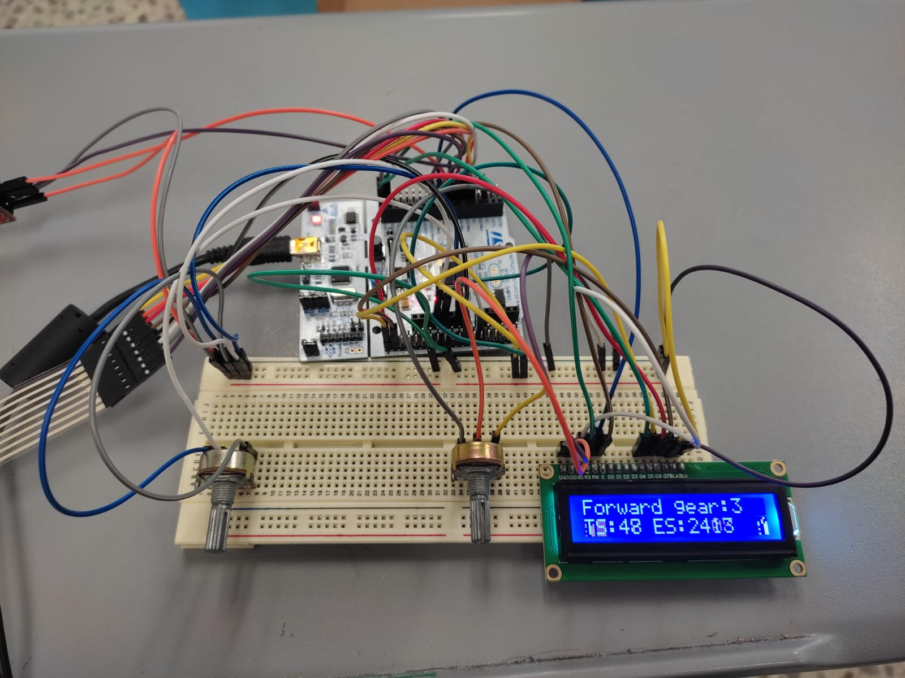
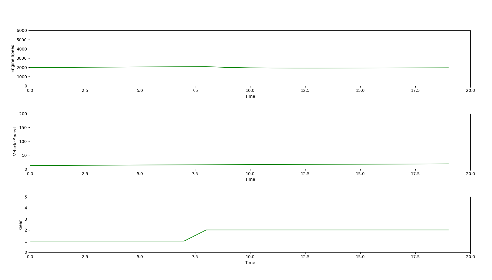

<div align="center">

# Tractor-dashboard

##### Dashboard simulation for a John Deere tractor utilizing STM32 microcontrollers and Raspberry Pi microprocessors. Proficiently programmed in C and Python to achieve seamless integration and functionality. 


</div>

## Overview

The simulation project involves creating a physical and virtual dashboard for a tractor using various components:
- **Physical Simulation:** Includes a breadboard, 2 potentiometers, 2 LEDS, 1 LCD, a matrix keypad, and various jumper cables.
  - **LCD:** Displays data such as current gear, direction, speed, and engine speed of the tractor.
  - **LEDs:** Used to simulate the tractor's blinkers.
  - **Potentiometers:** 
    - One controls the LCD's brightness.
    - The other functions as the tractor's throttle.
  - **Matrix Keypad:** 
    - Number 5 is used as the brake.
    - Number 4 changes the tractor's direction to the left.
    - Number 6 changes the tractor's direction to the right.

The circuit is connected to the MCU, coded in C to receive data from the potentiometer, interpret it as tractor values (speed, gear, etc.), display it on the LCD, and transmit it to the RPi using UART protocol. The MCU also features a real time operating system (RTOS) which helps to schedule and monitor tasks. The RPi, programmed in Python, receives the data, creates a figure with 3 animated graphs using Matplotlib, and saves the data in a `.csv` file.

## Repository Contents

The repository is organized into three main folders:

1. **FTDI Codes:**
    - Contains an Arduino code to use if an FTDI module is unavailable. The code can be uploaded to an Arduino to utilize its RX and TX ports.

2. **RPi Codes:**
   - Contains two Python scripts:
     - `config.py`: Contains plot characteristics and serial communication settings between the STM32 and the RPi.
     - `main.py`: Contains plotting and saving functions. This is the script you need to run.
    
3. **RPi Codes V2:**
    - Contains optimized versions of the scripts in the `RPi Codes` folder. These scripts utilize threading and queues to ensure real-time updating of the graphs.
      - `config.py`: Contains plot characteristics and serial communication settings between the STM32 and the RPi.
      - `main.py`: Contains plotting and saving functions, optimized for real-time performance.

5. **STM32 Codes:**
     - Contains all the header and source files used to code the MCU and the circuit components.
     - The file to compile in the STM32 Cube IDE is `main.c`.
  
6. **STM32 Codes RTOS:**
    - Contains an RTOS-supported version of the STM32 project. This modification features:
      - Priority scheduling.
      - Intercommunication between tasks.
      - Shared resources management.
      - Capability of simulating the tractor's blinkers with LEDs.


## Prerequisites
Before using the codes in this repository, ensure you have the following prerequisites:
- [STM32 Nucleo-F103RB Module](https://www.st.com/en/evaluation-tools/nucleo-f103rb.html)
- [STM32CubeIDE](https://www.st.com/en/development-tools/stm32cubeide.html)
- [Python](https://www.python.org/downloads/)
  - matplotlib.pyplot
  - pyserial
  - numpy
- [Raspberry Pi](https://www.raspberrypi.com/products/)
- STM32 Cube IDE
- 2 LEDs to simulate the tractor's blinkers.
- 2 potentiometers (1 for the LCD and 1 to control the tractor's acceleration)
- An LCD (Liquid Crystal Display)
- A breadboard
- An FTDI module
- A matrix keypad

## Usage

To use this repository, follow these steps:

1. **Clone the repository** on two different machines: one with the STM32 Cube IDE and the other with the RPi module. Use the following command:
   ```bash
   git clone https://github.com/HumbertoBM2/Tractor-dashboard.git
   ```
2. Prepare the physical circuit following the pin specifications in the STM32 Codes folder.

3. Upload the compiled code to the MCU using STM32 Cube IDE.

4. Run the main Python script on the RPi:
   ```python
   python3 main.py
   ```
5. Check the outputs:
   - A window with the Matplotlib figure and 3 subplots should appear, updating in real-time with the circuit's values.
   - The data should also display on the LCD. Test all the functionalities as described.

Feel free to explore and modify the code as needed for your project. For any issues or contributions, please open an issue or a pull request.

## Media

### Schematic 

### Circuit without the blinkers (LEDs)



- TS indicates Tractor's speed.
- ES indicates Engine's speed.
- The direction of the tractor is shown in the top left corner.

### Circuit with blinkers

- Now the LCD displays the units for each parameter. 

### Raw Python graphs generated with the received data 


### Python graphs (GUI)


### Task scheduling (RTOS)


